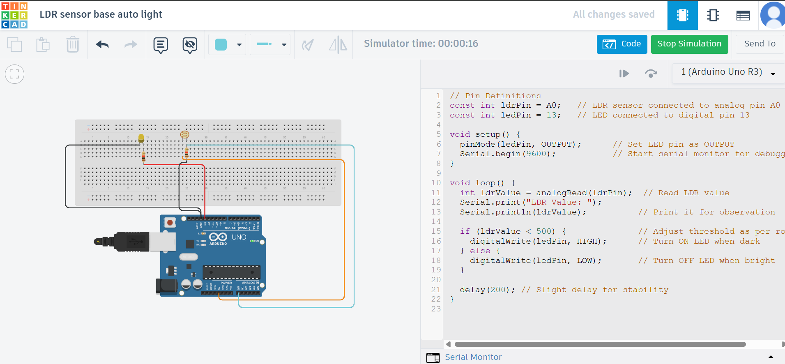

# 🌞 LDR Sensor-Based Auto Light – Arduino IoT Project

This project demonstrates an automatic lighting system using a **Light Dependent Resistor (LDR)** and an **LED**. The LED turns ON in darkness and OFF in bright conditions, simulating a **smart street light** or **night lamp**. It's ideal for beginners exploring **analog sensors**, **voltage dividers**, and **automated control** using Arduino.

---

## 📌 Project Overview

* 📡 Uses an **LDR** to detect ambient light.
* 💡 Automatically turns an **LED ON in darkness** and **OFF in brightness**.
* 🧠 Logic handled by an **Arduino UNO**, reading analog input and triggering digital output.
* 🏠 Simulates real-world smart lighting systems.

---

## 🔧 Components Required

| Component           | Quantity |
| ------------------- | -------- |
| Arduino UNO         | 1        |
| LDR (Photoresistor) | 1        |
| 10kΩ Resistor       | 1        |
| LED                 | 1        |
| 220Ω Resistor       | 1        |
| Breadboard          | 1        |
| Jumper Wires        | 6+       |
| USB Cable           | 1        |

---

## 🔌 Circuit Diagram

### Voltage Divider (LDR + 10kΩ Resistor)

```
    5V
     |
    [LDR]
     |
     +------> A0 (Analog Input)
     |
    [10kΩ]
     |
    GND
```

### LED Wiring:

* LED Anode (+) → Arduino Pin 13 (via 220Ω resistor)
* LED Cathode (−) → GND

---

## 💻 Arduino Code

```cpp
const int ldrPin = A0;   // Analog pin connected to LDR
const int ledPin = 13;   // LED connected to digital pin 13

void setup() {
  pinMode(ledPin, OUTPUT);
  Serial.begin(9600);
}

void loop() {
  int ldrValue = analogRead(ldrPin);
  Serial.print("LDR Value: ");
  Serial.println(ldrValue);

  if (ldrValue < 500) {             // Adjust this threshold as needed
    digitalWrite(ledPin, HIGH);     // Turn LED ON in darkness
  } else {
    digitalWrite(ledPin, LOW);      // Turn LED OFF in light
  }

  delay(200); // Small delay for stability
}
```

---

## 📸 Preview

> *(Add an image or GIF of the working circuit here — LED ON when light is blocked, OFF otherwise)*

---

## 🎯 Learning Objectives

* Understanding how LDR/photoresistors work
* Using **analogRead()** with voltage divider circuits
* Implementing decision logic with **if-else**
* Controlling actuators (LED) via sensor input

---

## 📁 Project Structure

```
LDR_Auto_Light/
├── LDR_Auto_Light.ino
├── README.md
└── circuit_diagram.png (optional)
```

---

## 🚀 Applications

* Smart Street Lights
* Night Lamps
* Light-activated Home Automation
* Automatic Garden Lights

---

## 📚 Next Steps

* Add **relay module** to control AC bulb
* Log data using **SD card** or **serial plotter**
* Control brightness using **PWM**
* Build mobile app interface (Flutter + Bluetooth)

---

## 👨‍💻 Author

**Ravi Rathor**
IoT & Embedded Developer | Flutter | Full Stack Enthusiast
🔗 [GitHub](#) • [LinkedIn](#) • [Portfolio](#)

---

