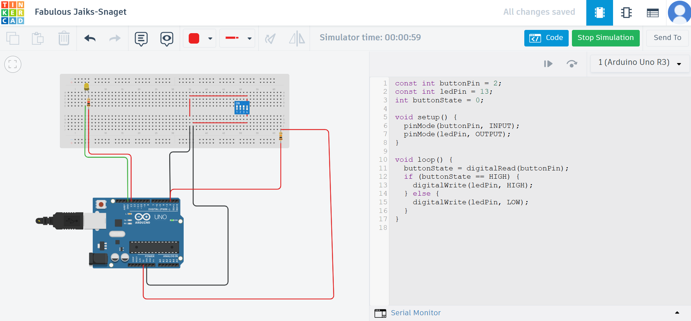

# 🔌 SPST Switch Controlled LED using Arduino

This project demonstrates how to control an LED using a **Single Pole Single Throw (SPST)** switch connected to an **Arduino Uno**. When the switch is turned ON, the LED lights up. When it is OFF, the LED turns off.

---

## 🧰 Components Used

| Component         | Quantity |
|------------------|----------|
| Arduino Uno       | 1        |
| Breadboard        | 1        |
| SPST Switch       | 1        |
| LED               | 1        |
| 220Ω Resistor     | 1        |
| 10kΩ Resistor     | 1        |
| Jumper Wires      | As needed |

---

## 🔌 Circuit Diagram

### Connections:

- **SPST Switch**
  - One terminal → GND
  - Other terminal → Digital Pin 2 (via a 10kΩ pull-up resistor to 5V)

- **LED**
  - Anode (+) → Digital Pin 13 (via 220Ω resistor)
  - Cathode (–) → GND

📝 **Pull-Up Resistor Note**: The pull-up resistor ensures the input pin reads HIGH when the switch is open and LOW when closed.

---

## 🧠 Working Principle

- The Arduino reads the digital input from the SPST switch.
- When the switch is **closed (pressed)**, the input pin reads **LOW**, and the LED is **turned ON**.
- When the switch is **open**, the input pin reads **HIGH**, and the LED is **turned OFF**.

---

## 🧾 Arduino Code

```cpp
const int buttonPin = 2;      // SPST switch input pin
const int ledPin = 13;        // LED output pin
int buttonState = 0;          // Variable to hold switch state

void setup() {
  pinMode(buttonPin, INPUT);
  pinMode(ledPin, OUTPUT);
}

void loop() {
  buttonState = digitalRead(buttonPin);

  if (buttonState == LOW) {       // Switch is pressed (GND)
    digitalWrite(ledPin, HIGH);   // Turn ON LED
  } else {
    digitalWrite(ledPin, LOW);    // Turn OFF LED
  }
}
````

---

## 📸 Simulation

You can simulate this project on [Tinkercad Circuits](https://www.tinkercad.com/) using Arduino Uno and virtual components.

---

## 📚 Learning Outcome

* Understand digital input and output with Arduino
* Learn how SPST switches work in circuits
* Use pull-up resistors for stable switch input readings

---

## 🧑‍💻 Author

**Ravi Rathor**
B.Tech - Computer Science & Engineering
Passionate about embedded systems and IoT projects.

