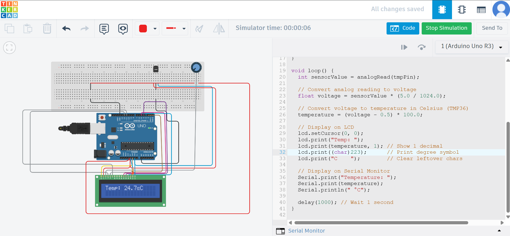

# 🌡️ Arduino Temperature Display using TMP36, LCD & Potentiometer

A beginner-friendly **IoT-based temperature monitoring system** built using **Arduino UNO**, a **TMP36 analog temperature sensor**, and a **16x2 LCD display**. The system displays live temperature in Celsius on the LCD screen, with a **10K potentiometer** used to control display contrast.

---

## 🛠️ Features

* Displays **real-time temperature** on 16x2 LCD.
* **Potentiometer** adjusts LCD contrast for better visibility.
* Uses **TMP36 sensor** for accurate temperature reading.
* Easy-to-understand wiring and fully customizable code.
* Can be simulated in **Tinkercad** or built on real hardware.

---

## 🔧 Components Required

| Component                   | Quantity  |
| --------------------------- | --------- |
| Arduino UNO                 | 1         |
| TMP36 Temperature Sensor    | 1         |
| 16x2 LCD Display (No I2C)   | 1         |
| 10K Potentiometer           | 1         |
| 220Ω Resistor (for LCD LED) | 1         |
| Breadboard + Jumper Wires   | As needed |

---

## 🔌 Circuit Connections

### ➤ **TMP36 Sensor**

| TMP36 Pin     | Connects To |
| ------------- | ----------- |
| Left (VCC)    | 5V          |
| Middle (Vout) | A0          |
| Right (GND)   | GND         |

---

### ➤ **16x2 LCD Display (without I2C)**

| LCD Pin | Name | Connects To                 |
| ------- | ---- | --------------------------- |
| 1       | VSS  | GND                         |
| 2       | VDD  | 5V                          |
| 3       | V0   | Middle pin of potentiometer |
| 4       | RS   | Digital Pin 12              |
| 5       | RW   | GND                         |
| 6       | E    | Digital Pin 11              |
| 11      | D4   | Digital Pin 5               |
| 12      | D5   | Digital Pin 4               |
| 13      | D6   | Digital Pin 3               |
| 14      | D7   | Digital Pin 2               |
| 15      | A    | 5V via 220Ω resistor        |
| 16      | K    | GND                         |

---

### ➤ **Potentiometer (10K)**

| Pot Pin         | Connects To    |
| --------------- | -------------- |
| Left (or Right) | 5V             |
| Right (or Left) | GND            |
| Middle (wiper)  | LCD Pin 3 (V0) |

---

## 💻 Arduino Code

```cpp
#include <LiquidCrystal.h>

// LCD pin mapping: RS, E, D4, D5, D6, D7
LiquidCrystal lcd(12, 11, 5, 4, 3, 2);

// TMP36 analog input pin
const int tmpPin = A0;
float temperature;

void setup() {
  lcd.begin(16, 2);           // Initialize LCD
  lcd.print("Temp Monitor");  // Welcome message
  delay(2000);
  lcd.clear();                // Clear screen
  Serial.begin(9600);         // Start serial monitor
}

void loop() {
  int sensorValue = analogRead(tmpPin);
  float voltage = sensorValue * (5.0 / 1024.0);        // Convert to voltage
  temperature = (voltage - 0.5) * 100.0;               // TMP36 formula

  lcd.setCursor(0, 0);
  lcd.print("Temp: ");
  lcd.print(temperature, 1);     // 1 decimal place
  lcd.print((char)223);          // Degree symbol
  lcd.print("C    ");            // Clear remaining chars

  Serial.print("Temperature: ");
  Serial.print(temperature);
  Serial.println(" °C");

  delay(1000);  // Update every second
}
```

---

## 🧪 Output Example

```
LCD Display → Temp: 27.5°C
Serial Monitor → Temperature: 27.5 °C
```

---

## 📚 Applications

* Room temperature monitoring
* Educational IoT or Arduino projects
* Smart thermostat base
* Greenhouse or lab temperature display

---

## 📦 How to Simulate (Tinkercad)

1. Visit [Tinkercad Circuits](https://www.tinkercad.com/circuits)
2. Add components: Arduino UNO, 16x2 LCD, TMP36, 10K potentiometer
3. Wire as per the circuit table above
4. Paste the code, start simulation, and open serial monitor

---

## 📎 License

This project is released under the [MIT License](LICENSE).
