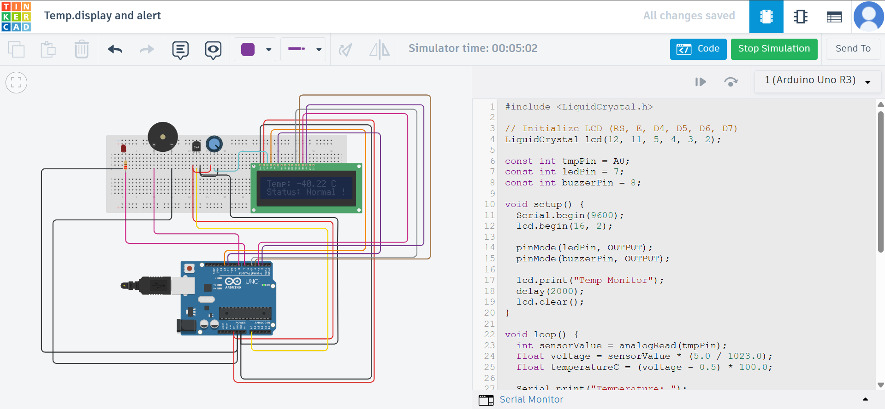

# 🌡️ Arduino Temperature Monitor with Alert 🚨

A simple IoT-inspired project using **Arduino Uno**, **TMP36 temperature sensor**, **LED**, **buzzer**, and **LCD display** to monitor temperature and trigger alerts when it exceeds a safe threshold.
Built & simulated on **Tinkercad** in \~20–30 minutes!

---

## 🧰 Components Used

* Arduino Uno
* TMP36 temperature sensor
* 16×2 LCD display + potentiometer (or I2C LCD)
* Breadboard & jumper wires
* LED (for visual alert)
* Buzzer (for audible alert)
* Resistors (220Ω for LED, \~10kΩ for potentiometer)

---

## 🔗 Project Overview

✅ Reads the ambient temperature using TMP36 sensor.
✅ Displays real-time temperature on LCD and Serial Monitor.
✅ Turns on LED & buzzer if temperature > **30°C**.
✅ Status shown clearly on LCD (`Normal` or `!! ALERT HIGH !!`).

---

## ⚙️ Circuit Diagram


### Connections:

| Component           | Arduino Pin     |
| ------------------- | --------------- |
| TMP36 VCC           | 5V              |
| TMP36 GND           | GND             |
| TMP36 Signal        | A0              |
| LED (+)             | Pin 7           |
| Buzzer (+)          | Pin 8           |
| LCD RS              | Pin 12          |
| LCD Enable          | Pin 11          |
| LCD D4, D5, D6, D7  | Pins 5, 4, 3, 2 |
| Potentiometer sides | 5V & GND        |
| Potentiometer wiper | LCD Vo          |

💡 If you’re using an I2C LCD, replace LCD wiring with SDA & SCL connections and adjust the code accordingly.

---

## 👨‍💻 How It Works

🎯 The TMP36 outputs an analog voltage proportional to the temperature.
🎯 Arduino reads this voltage and converts it to Celsius.
🎯 If temperature > 30°C:

* LED turns ON
* Buzzer sounds
* LCD displays `!! ALERT HIGH !!`
  🎯 Else, system stays in `Normal` state.

---

## 📋 Sample Output

**Serial Monitor:**

```
Temperature: 28.75 °C
Temperature: 31.12 °C  ← Alert triggered!
```

**LCD Display:**

```
Temp: 31.1 C
!! ALERT HIGH !!
```

---

## 📝 Arduino Code

The full code is available in the [main.ino](main.ino) file.
It uses:

* `LiquidCrystal` library for LCD
* AnalogRead for TMP36
* DigitalWrite for LED & buzzer control

---

## 🚀 Getting Started

1️⃣ Build the circuit in Tinkercad or on real hardware.
2️⃣ Upload the code to Arduino Uno.
3️⃣ Open Serial Monitor (baud: 9600) to see readings.
4️⃣ Observe LCD, LED, and buzzer respond as per temperature.

---

## 📚 References

* TMP36 Datasheet: [Analog Devices](https://www.analog.com/media/en/technical-documentation/data-sheets/TMP35_36_37.pdf)
* Arduino LiquidCrystal Library: [Official Docs](https://www.arduino.cc/en/Reference/LiquidCrystal)

---

## 📜 License

This project is open-source and free to use for learning and personal projects.
